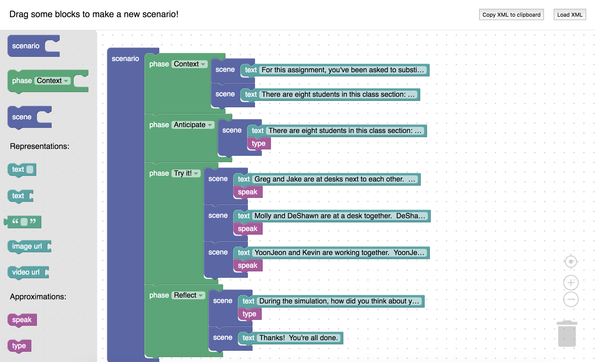

# threeflows-blockly
Experimenting with a blocks-based editor for Teacher Moments scenarios (http://github.com/mit-teaching-systems-lab/threeflows)

## Demo
See [https://threeflows-blockly.herokuapp.com/](https://threeflows-blockly.herokuapp.com/).



## Run locally
```
$ npm install
$ npm start
```

This project was bootstrapped with [Create React App](https://github.com/facebookincubator/create-react-app).